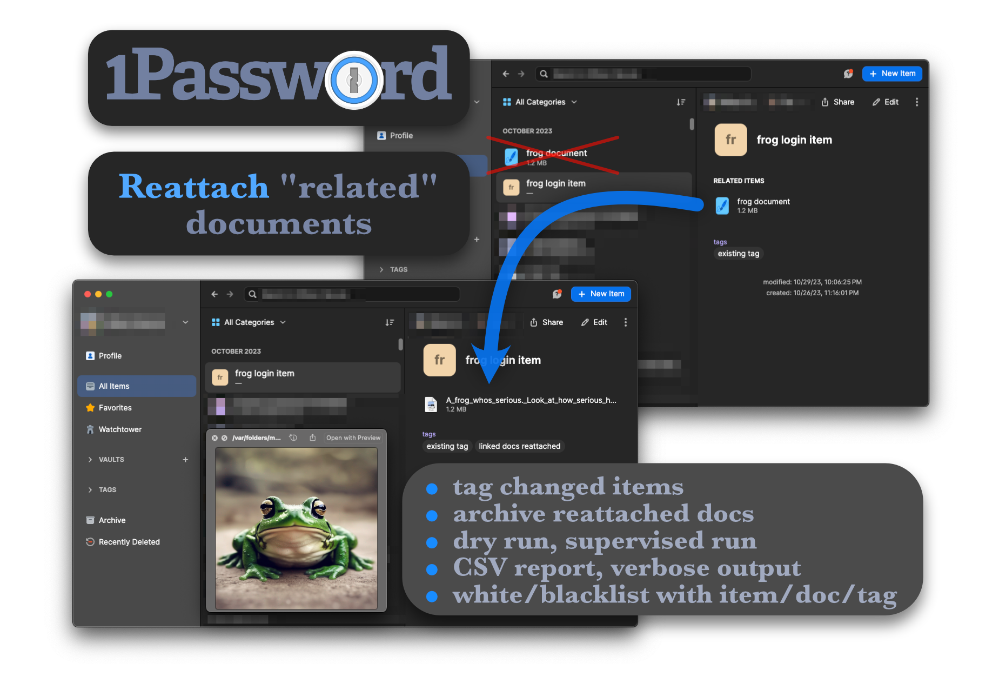

# 1Password document reattacher



This script is used to convert documents that were created automatically from item attachments during the upgrade process to 1Password v7 back into attachments. With the release of 1Password 8, attachments are back, and this script reverses the process that took place during the upgrade to version 7, replacing document references with attachments and removing the standalone document items and document references.

* **Make a backup of your 1Password account before use**  
  * Use "*File → Export → \<your account name\>*" before running this script, and use the `--dry-run` or `--supervise-run` options for finer visibility and control over the process.
  * Multiple options exist in order to control and verify what will be changed, and to supervise/approve each document before reattachment/removal
* A report of the changes will be saved to a csv file in the current directory.
* Sorry it's so slow. Profiling reveals ~100% of the time is spent calling the 1Password CLI tool. Use the `--generate-share-links` if you want to see *how much slower* it can be.

### Document reattachment by explicit references

This will replace all references to stand-alone documents with attachments—not only those created in the v7 upgrade process. If a document has additional files attached to it, those additional files will be lost (this would never happen with documents created during the v7 upgrade). 

After successful reattachment, it will archive the stand-alone documents and remove the document references from the items that referenced them. It will not consider standalone documents except those referenced by some other item. If multiple items reference the same standalone document, it will be added as an attachment to each referencing item. It will also archive the original documents if the `--archive-docs` flag is set. 

### Additional document cleanup

After a successful run of the explicit method, you'll be asked if you want to check remaining documents to find any remaining documents that could be cleaned up (removed). This method will
* remove single-file documents that show "File Missing" in 1Password
* remove single-file documents referenced explicitly by an archived item
* check for documents named like those created during the 1P v7 upgrade process (e.g. "file name - item name"), and search for items that match the implied item name, and 
  * if found, remove document if its size/name matches one of the item's attachments
  * if not found, remove document pending user approval (regardless of whether `--confirm-before-modifying` is used)

The `--cleanup-documents` option will forego the explicit method and immediately run the document cleanup routine.

## Installation

1. Clone this repository with `git clone https://github.com/twilsonco/1PasswordDocumentReattacher && cd 1PasswordDocumentReattacher`
2. Run `pip install -r requirements.txt` to install the required packages before running the script.
3. Install [1Password CLI tool](https://developer.1password.com/docs/cli/get-started/) using "*Install 1Password CLI...*" in the menu, or with `brew install 1password-cli` on macOS 

## Example usage

 ```sh
 1password_document_reattacher.py --dry-run --archive-docs --supervise-run --item-whitelist "item1" "item2" --item-blacklist "long item3" "item forty-two"
 ```

## Arguments

* `--dry-run`: If set, the script will not make any changes and will only simulate the actions. This is useful for checking the results before committing.
* `--delete-docs`: If set, the script will archive the original documents after converting them back into attachments.
* `--supervise-run`: If set, the script will wait for user confirmation before each action. This allows for checking results on a per-item basis.
* `--confirm-before-modifying`: Ask the user before starting to reattach documents.
* `--verbose`: If set, the script will print detailed information about its actions. Always on if `--supervise-run` is used.
* `--item-whitelist`: A list of partial item names that should be included in the conversion process.
* `--item-blacklist`: A list of partial item names that should be excluded from the conversion process.
* `--doc-whitelist`: A list of partial document names that should be included in the conversion process.
* `--doc-blacklist`: A list of partial document names that should be excluded from the conversion process.
* `--tag-whitelist`: A list of item tags that should be included in the conversion process.
* `--tag-blacklist`: A list of item tags that should be excluded from the conversion process.
* `--op-cli-path`: The path to the op command line tool. If not specified, the script will assume that the tool is installed in `/opt/homebrew/bin/op`.
* `--generate_share_links`: Output/verbose/supervising output will contain links to 1Password items to simplify following along. Always on if `--supervise-run` is used.
* `--cleanup-documents`: Instead of reattaching documents based on explicit links between items, clean up standalone (single-file) document items that were not reattached when running the script normally without this option. Cleans us documents whose linking items are missing/archived/deleted, whose files are missing, or that appear to have been created during the 1P v7 upgrade base on their name. This is meant to be used after successful completion of the explicit method.

## Known issues

* The primary use of the tool works well, when it's looking over the list of items, reattaching documents based on references to each document in each item
* There are issues with the `--cleanup-documents` option
  * Everything seems to be working correctly on my end, however, the majority of leftover, spurious documents identified by the tool fail to tag/delete, or fail to save the docuemnt file to disk
  * For some documents, the 1Password CLI tool errors when fetching the document file, saying the item isn't a document, although I can open the document item in 1Password and confirm it's a document, in the documents category
  * For other documents, when the command to delete/archive is used, the 1Password CLI tool segfaults, complaining about an invalid memory address. Again, I can open the affected item/documents in 1Password and they act normal.
  * For these, the only option is to manually delete using 1Password.
  * I have no idea what's causing the issues, nor can I easily troubleshoot, nor does AgileBits care.
    * They've simply ignored the mess leftover from the 1P v7 upgrade process. Their negligence here feels like a punishment for anyone foolish enough to have been their customer before v7.